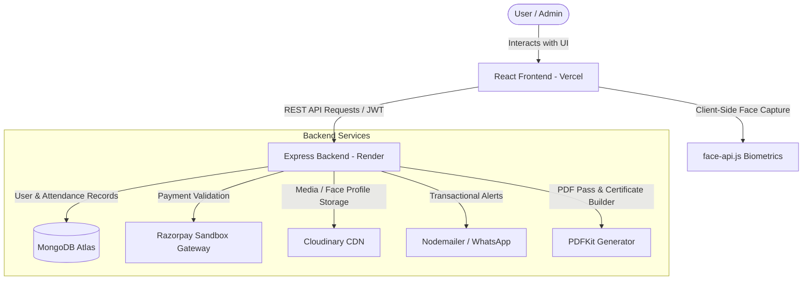

# Eventra - Next-Gen Event Management Portal 🚀

Eventra is a premium, high-performance full-stack event management platform built using the modern **MERN** ecosystem. Engineered for visual excellence and bulletproof reliability, it integrates advanced biometric face recognition check-ins, a secure dual-mode Razorpay payment verification engine, dynamic administrative reporting analytics, and automated PDF certificate generation.

---

## 🏗️ System Architecture & Workflow

The diagram below maps the dynamic interactions between the Vercel-hosted React client, the Render-hosted Node.js API server, and third-party SaaS cloud platforms:



---

## 💻 Tech Stack Breakdown

Eventra's engineering architecture is separated into clean, modular layers:

### Frontend Client-Side

* **Core:** React 18, React Router v6
* **State & Forms:** React Context API, React Hook Form
* **Design & Animations:** Tailwind CSS (Harmonious sleek dark-mode), Framer Motion, Lucide React Icons
* **Biometrics Engine:** `face-api.js` (TensorFlow.js backend) for browser-based face landmark detection and registration validation

### Backend API Server

* **Server Runtime:** Node.js, Express.js
* **Database Layer:** MongoDB Atlas (Mongoose ORM with secure schemas)
* **Authentication:** Stateless JSON Web Tokens (JWT) with secure HTTP headers
* **Biometric Model:** Pure Node.js face landmark matching with Euclid distance checks
* **Documents & Media:** PDFKit (Passes and Certificates Builder), Cloudinary CDN (Image uploads integration)

---

## 🌟 Core Features Showcase

### 1. Biometric Attendance Ecosystem 👤

* **Intelligent Capture:** Local camera captures are monitored by `face-api.js` landmarks. Capturing pauses automatically if the person is out of frame.
* **Server Verification:** Face images are securely stored in Cloudinary and registered into the MongoDB User record. Checking-in checks Euclidean distances dynamically on the server to prevent spoofing.

### 2. Sandbox Payment Integration 💳

* **Dual Flow Compatibility:** Support for both live simulated payments (bypassing Razorpay popup) and real Sandbox test checkouts.
* **Secure Webhooks:** The server executes post-checkout verification checks, validates cryptographic signatures, and persists successful bookings to the `Payment` ledger.

### 3. Automatic Certificate Issuance 🏆

* **State-Machine Completion:** Marking an event as "completed" in the Admin panel triggers an asynchronous runner that auto-generates customized participant certificates.
* **Digital Distribution:** Generated certificates are saved to the database and automatically dispatched as PDF attachments via email.

---

## 🚀 Local Development Quickstart

Follow these steps to run the frontend and backend servers concurrently on your local machine:

### Prerequisites

Make sure you have **Node.js (v18+)** and **npm** installed on your system.

### Step 1: Clone & Install Dependencies

```bash
# Clone the repository
git clone https://github.com/Krsonunigam/Eventra.git
cd Eventra

# Install backend dependencies
npm install

# Install frontend client dependencies
cd client
npm install
cd ..
```

### Step 2: Environment Configuration

1. Create a `.env` file in the **root directory** and supply the following variables:
   ```env
   PORT=5000
   MONGO_URI=your_mongodb_atlas_connection_string
   JWT_SECRET=your_jwt_signing_key

   RAZORPAY_KEY_ID=your_razorpay_key_id
   RAZORPAY_KEY_SECRET=your_razorpay_key_secret

   CLOUDINARY_CLOUD_NAME=your_cloudinary_name
   CLOUDINARY_API_KEY=your_cloudinary_key
   CLOUDINARY_API_SECRET=your_cloudinary_secret

   EMAIL_USER=your_nodemailer_email
   EMAIL_PASS=your_nodemailer_app_password

   CLIENT_URL=http://localhost:3000
   ```
2. Create a `.env` file inside the `client/` folder and add:
   ```env
   REACT_APP_RAZORPAY_KEY_ID=your_razorpay_key_id
   ```

### Step 3: Run the Application

You can run the backend and frontend servers simultaneously using the root development script:

```bash
# From the project root directory
npm run dev
```

* **Frontend Access:** [http://localhost:3000](http://localhost:3000)
* **Backend API Base:** [http://localhost:5000](http://localhost:5000)

---

## 🌐 Production Deployment Guide

Deploying the system to cloud platforms (Vercel and Render) is fast and seamless:

### 1. Deploy the Backend (Render)

1. Log in to your **[Render Dashboard](https://dashboard.render.com)**.
2. Select **New** -> **Web Service** and link your GitHub repository.
3. Configure the following parameters:
   * **Build Command:** `npm ci --omit=dev`
   * **Start Command:** `npm start`
4. Add all environment variables from your root `.env` file. Ensure `CLIENT_URL` points to your live Vercel domain (`https://eventrafrontend.vercel.app`).
5. Click **Deploy**. The service will live at **`https://eventraind.onrender.com`**.

### 2. Deploy the Frontend (Vercel)

1. Log in to your **[Vercel Dashboard](https://vercel.com)**.
2. Click **Add New** -> **Project** and select your GitHub repository.
3. In the configuration settings:
   * **Framework Preset:** `Create React App`
   * **Root Directory:** Select `client`
4. In the **Environment Variables** section, add:
   * `REACT_APP_API_URL` = `https://eventraind.onrender.com`
   * `REACT_APP_RAZORPAY_KEY_ID` = `your_razorpay_key_id`
5. Click **Deploy**. Your premium client interface goes live instantly!

---

## 🛡️ Security Hardening Included

* **NoSQL Injection Prevention:** Automatic mongo sanitization across raw queries.
* **XSS Defense:** String sanitize routines on form input fields.
* **Modern Mongoose Hooks:** Synchronous pre-validation lifecycle hooks to prevent legacy callback execution hangs.

---

*Built by the Eventra Engineering Team.*
